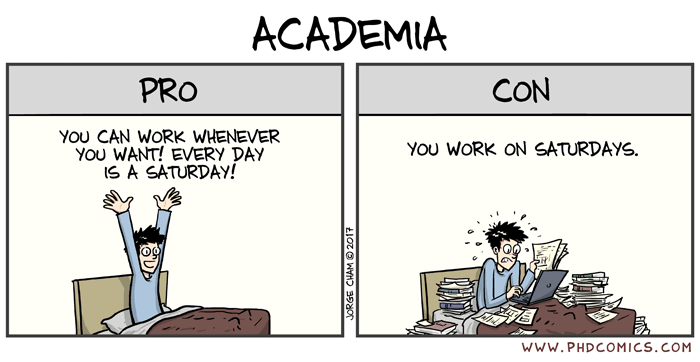

It has officially been a year since I transitioned from being a Marine Biologist to a Data Scientist. I wanted to reflect on the transition a career change involved during this past year and share my experiences with others who might be in a similar position. I am hoping to articulate my thoughts in a coherent way, although I am not sure how this blog piece is going to turn out. I would like to make it clear that the experiences and feelings I am going to mention here are specific to me and are not intended to represent anyone else’s opinions.

A little bit about my background: I have always been fascinated by the natural world and always wanted to study and understand it. It was actually a [BBC series called Oceans](https://www.bbc.co.uk/programmes/b00fnm6q) which bridged the gap between “awe-inspiring nature documentary” and real-life research in the marine sciences that pushed me in the direction of marine biology. I studied an MSci Marine Biology at University before moving to Singapore working as a field biologist teaching school children all about biology away from the classroom. Despite this wonderful opportunity to share my passion of all things nature to the next generation *in situ*, I missed the constant learning and study that came about through research. Therefore, I embarked on a PhD^[The title of my thesis was "The role of climate change, species invasions and hybridisation in the redistribution of marine biodiversity"- a very general title for an extremely niche topic] back in the UK, before then working as a postdoctoral researcher at the same University. Like many others, during my graduate student days I felt that I was only being prepared to go down one career path, that of an academic researcher. There was very little talk about any other careers and as I was always happy in my little academic bubble, I didn’t necessarily feel the need to look elsewhere for alternative advice or ideas.

### Benefits of Academia

Academia provided me with many positive experiences and opportunities. I had the freedom and flexibility to structure my day around my needs, and I didn't have to conform to the typical nine-to-five work schedule. This autonomy allowed me to balance my work and personal responsibilities more effectively, and I appreciated not being micromanaged. Moreover, I was fortunate to travel around the world for my research and collaborate with passionate colleagues who shared my enthusiasm for the field. Beyond the technical skills I developed, I also gained practical knowledge, such as figuring out how to keep 40 jars of fertilized eggs alive using makeshift equipment because it’s 3am in the morning and no stores are open! The work was highly fulfilling, and I loved the idea of contributing to the advancement of knowledge and knowing that future scholars would build upon my findings. Despite not being one for small talk, I did enjoy getting to say at parties that my job was a “marine biologist” - which despite being constantly responded with “oh I wanted to be a marine biologist when I was seven too” always gave me great pride. Finally, the thrill that the “next big discovery” could be waiting just around the corner, and that feeling when you realise you’re the first person ever to identify and describe a new result and insight, was completely indescribable.

### What I struggled with in academia

Academia was an amazing experience, but it certainly had its challenges. 

**Stress and anxiety:** As an academic, I felt the constant pressure to publish papers, as it felt this was the only way to achieve career progression and secure funding. This "publish or perish" mentality took a toll on me and contributed towards imposter syndrome. Whilst I did not feel this until my postdoc position, I know from experience than many PhD students go through periods of anxiety and depression.

**Low salaries:** Despite the high level of education and expertise required for academic positions, salaries are often lower than those in other professions. After nine years in higher education, I was still making less money than friends who went into finance straight out of university. Unless you are a senior tenured professor, this is the reality for most of your career.

**Academic pessimism:** A unique challenge that I found was the seeming constant negativity displayed online by some of the academics I looked up to. Often, they absolutely had a right to complain, wages are low, contracts are short, workload is unmanageable; but at a stage in my career where I personally needed to see the positives of academia, seeing those you aspire to work almost showing resentment towards the academic system, it wasn’t a good selling point for remaining in this field. 

**Real-word applications:** I, as well as the majority[^1] of academics, became an academic due to an insatiable desire to find out things and be curious - I love learning for the sake of it. I read every interpretation board in museums (much to the annoyance of my partner), not because I think it will improve my life, but because I enjoy learning new things. I soon found that the research I was doing needed to be grounded to real-world applications to get funding. I loved learning about bizarre and fascinating creatures, even if it didn't have a practical application, and I missed this blue-sky approach that initially drew me to Marine Biology. However, in academia, research was mostly determined by practical applications, which whilst being extremely important wasn't the main driver for me. I concluded that if I was going to be doing research that impacts the ‘real-word’ anyway, why not do it in a different discipline that could alleviate many of these other issues.

[^1]: no citation, just a hunch `¯\_(ツ)_/¯`

**Work-life balance:**
Finally, the phrase "do what you love, and you'll never work a day in your life" was a misnomer for me. I loved (and still do love) marine biology, but it was also my work, and my work bled into my personal life. I struggled to switch off, felt guilty for watching a movie when I could be reading the latest published paper in my field, and found myself thinking of research projects rather than enjoying family time with my loved ones. I vividly remember the straw that broke the camel’s back was where I sat down to watch the latest Attenborough documentary and I felt my stomach drop because it felt like work. The awe-inspiring documentaries that had initially inspired me to become a researcher had become a chore. Something had to change.

### Data Science: A New Hope

Enter data science. I hadn't appreciated until I started exploring opportunities outside academia that a lot of the work I was doing in my research career was relevant data science. To be honest, I was doing data science without even realising what data science was! For example, I was doing unsupervised machine learning when I was clustering populations based on their genetic code and I was improving my storytelling techniques when I was disseminating the same piece of research via an academic manuscript, an internal departmental seminar and a high-level science communication piece. 

### Overcoming new obstacles

Despite these similarities between roles, there are differences between academia and industry that have taken some getting used to. 

**Speed of work:** For one, the speed of work is much quicker in data science. In academia, my last postdoc position lasted for 20 months, which was less than half of the 5-year contract that the research project was funded for. My PhD thesis took 42 months to complete and only consisted of four separate research projects. However, in data science in industry, projects can range from a few hours to a few weeks.

**Speed-accuracy trade off:** In academia, I could afford to give myself almost unlimited time to understand a tricky concept or investigate an algorithm with precision and confidence. In industry, however, this isn't viable. I've had to learn that "good enough" is okay, and that key business decisions can still be made without spending months learning and performing thesis level calculations.

**Topics of research:** I had more freedom to choose the research questions I wanted to focus on. In my current role, I'm lucky enough where my opinion on which avenues of research we pursue is listened to, but ultimately, the client or organization has the final say. As someone who enjoys the novelty of different research paths, this hasn't been an issue for me yet, but I can see how it could become more challenging over time.

### What I love about my new role
	
Despite these transitional challenges, every time I am asked whether I am enjoying my new role a smile comes across my face. There are many aspects of my current role which I love but are undoubtedly organisation specific, however more generally I feel working in industry means I can benefit greatly from the following:

**Working in a team:** One of the biggest changes from academia is that I now work as part of a team, bouncing ideas off one another and working together towards a common goal. In academia, research can feel very isolating, and as someone who worked remotely for a large portion of my postdoc, it felt like I was working to progress myself most of the time. Now, I am part of a dynamic and talented team where I truly feel we are working towards a common goal.
	
**Job security:** There is a high likelihood my career path would have been 10 years of moving around frequently for short term contracts ranging from 6-24 months. I now have a full-time contract with my current employer, which allows me to put down roots in the city I live in.

**Feeling appreciated:** I had the experience of being at the same University for my undergraduate, masters, PhD, and then postdoc (whilst this is rare, it certainly isn’t unheard). In academia as an early career researcher, I often felt like I was still treated as a student, even though I was a member of staff (I even had my name on the door of my shared office). When I and my colleagues published one of the chapters from my PhD in a highly regarded academic journal during my postdoc, I was thrilled to have been the lead author. However, when our Head of School sent an email to the department congratulating my supervisor and "their student" for the work, even though I had already been a member of staff for more than a year at that point. But now, I am in an environment where my work is valued and recognized, which is a great feeling- businesses realise that to keep employees happy their good work should be appreciated!

### Parting words

Transitioning from academia to a new career can be a challenging and uncertain process. As someone who has made the leap from academia, I can attest to the difficulties and rewards of such a transition. My final advice to anyone contemplating a similar move is to not be afraid to explore new opportunities.

It's common to feel hesitant about leaving behind what may have seemed like "the job of your dreams". However, the reality of academia can often be a solitary and uncertain experience, especially if you are explaining your experiences to loved ones who have not been in the academic system. When I made the decision to leave, I was worried about how my family would perceive it, given the time, money, and energy they had invested in my education. But with the support of those around me, I was able to embrace this new chapter in my career.

I encourage those considering leaving academia to remember that their academic experiences have provided them with a wide range of skills, including project management, data analysis, technical writing, and mentoring to name just four. Transitioning to a new career doesn't mean leaving behind your passion for learning and knowledge.

If you're considering making the leap, know that you're not alone. Leaving academia can be a difficult decision, but it's one that many of us have made. If you want to talk more about your own situation or hear about my experience, feel free to send me a message.
