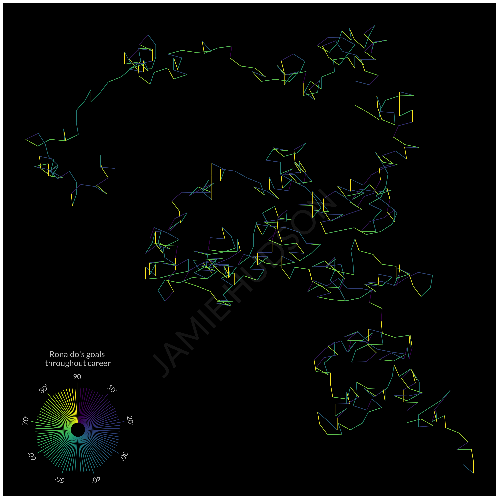
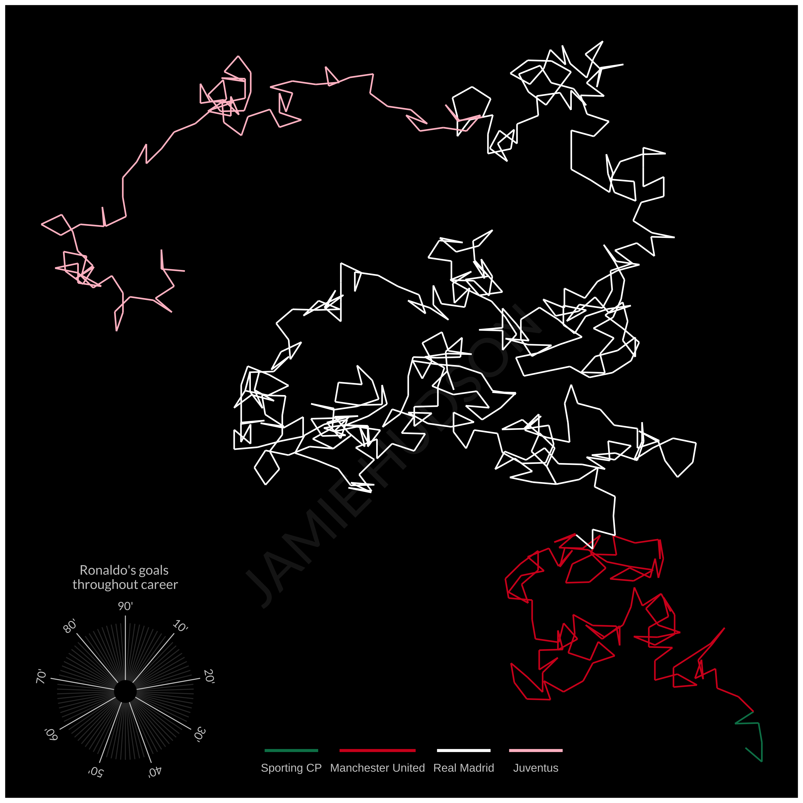
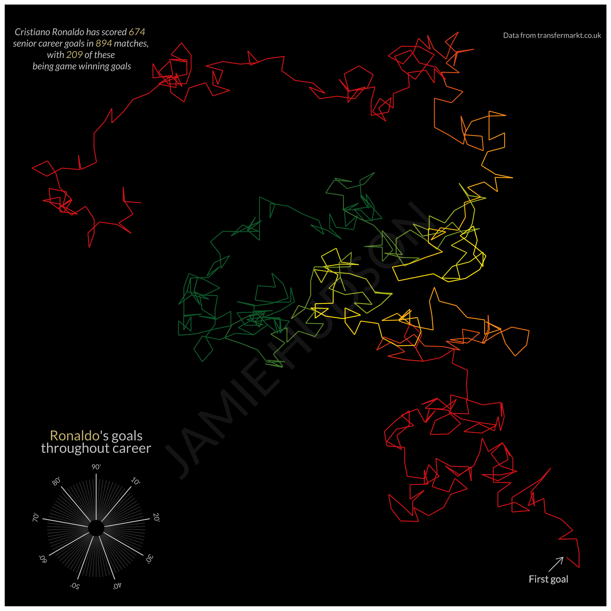

---
authors:
- admin
categories: []
date: "2021-07-10T00:00:00Z"
draft: false
featured: true
image:
  caption: ""
  focal_point: ""
gallery_item:
- album: gallery
  caption: Messi
  image: col_country_messi.png
- album: gallery
  caption: Ruud
  image: col_country_ruud.png
- album: gallery
  caption: Henry
  image: col_country_henry.png
- album: gallery
  caption: O'Shea
  image: col_country_oshea.png
projects: []
subtitle: Another great showcase of what can be performed in R!
summary: Another great showcase of what can be performed in R!
tags: []
title: An Rtistic walk through footballer's careers.
---

## Background

I soon realised in my data visualisation journey that Nadieh Bremer would endlessly provide inspiration to me. I highly recommend checking our her work at [Visual Cinnamon](https://www.visualcinnamon.com/).

One of Nadieh's pieces is a lovely visualisation of the [digits of 𝜋](https://www.visualcinnamon.com/2015/01/exploring-art-hidden-in-pi/), where effectively each digit (0-9) is mapped to a compass direction, with each subsequent digit producing a new step in a different direction (so long as the digit was different to the previous one). The final result is a beautiful walk through 𝜋. 

To adapt this concept to my interests, I decided to use a similar 'random' walk approach to artistically visualise footballers careers.

## Footballer's careers

I obtained data on all of the goals that certain players scored in their club careers via the [transfermarkt website](https://www.transfermarkt.co.uk/), and mapped the minute of each goal to a compass direction. As transfermarkt records goals scored in injury time of both halves as 45' and 90', there are a total of 90 minutes that a goal could be scored in. This meant that each minute would represent a 4º change in direction (360º/4).

I wrangled and visualised the data using the `{tidyverse}` packages in R `{dplyr}` and `{ggplot2}` (where would I be without them).

Similar to Nadieh, I played around with different colour schemes to see how these changed the visualisation. Initially I mapped colour to minute (and hence direction), though I wasn't convinced with the double mapping of colour and direction to minute. An example of this can be seen below with Cristiano Ronaldo used as an example.

I then thought of using colour to represent additional aspects of the dataset. For example, as of the writing of this post (10 July 2021), Ronaldo has played for a total of four clubs at senior level (Sporting CP, Manchester United, Real Madrid, and Juventus). I mapped the club that he was playing for when he scored each goal to a colour that generally corresponds to each club (Sorry Juventus, Los Blancos prioritise the use of white). 

Whilst I actually think this works nicely for someone like Ronaldo who has played for relatively few clubs, if I had made this for someone like Rivaldo (who played for 15 clubs), it would get quite messy. I decided to use `ggplot::scale_colour_gradientn` function to create a gradient of colours, through the players career, that correspond to the colours of their national team. This, as well as annotating the figure with updatable metrics (such as the number of goals and games played) and specifying where the walk starts (first goal), produced the final version:

See below for a galler of some of the players that I have created these visualisations for. As an Ireland and Manchester United, I couldn't help but include the mighty John O'Shea in this pantheon of all-time greats.



I hope you enjoy!

